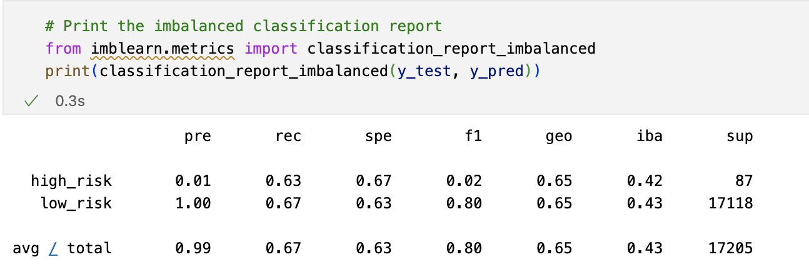
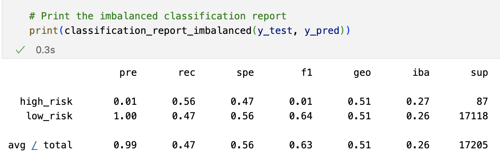
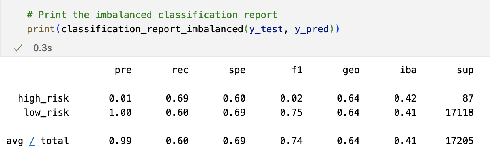
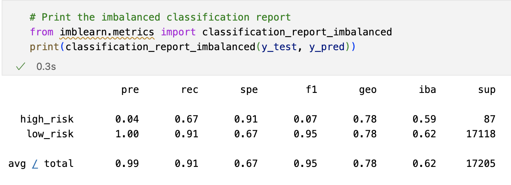
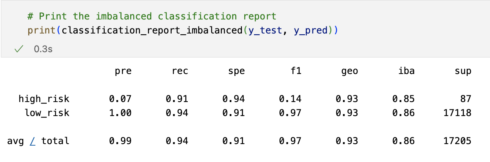

# Credit Risk Analysis

## Purpose

The purpose of this analysis is to look at data from LendingClub, a peer-to-peer lending services company, and evaluate and train models with unbalanced classes. The Imbalanced-learn and scikit-learn libraries were utilized, as well as both over- and undersampling of the data. Finally, a written evaluation of the models was done to how well they predict credit card risk.

## Results

<b> Naive Random Oversampling </b>

1. Balanced Accuracy: 0.6533977140416822
2. Precision: High Risk= 0.01; Low Risk = 1.00
3. Recall: High Risk= 0.63; Low Risk = 0.67

<b> SMOTE Oversampling </b>

1. Balanced Accuracy: 0.6512291961274883
2. Precision: High Risk= 0.01; Low Risk = 1.00
3. Recall: High Risk= 0.64; Low Risk = 0.66

<b> Undersampling </b>

1. Balanced Accuracy: 0.6512291961274883
2. Precision: High Risk= 0.01; Low Risk = 1.00
3. Recall: High Risk= 0.56; Low Risk = 0.47

<b> Combination (Over and Under) Sampling </b>

1. Balanced Accuracy: 0.5147555910092623
2. Precision: High Risk= 0.01; Low Risk = 1.00
3. Recall: High Risk= 0.69; Low Risk = 0.60

<b> Balanced Random Forest Classifier </b>

1. Balanced Accuracy: 0.7877672625306695
2. Precision: High Risk= 0.04; Low Risk = 1.00
3. Recall: High Risk= 0.67; Low Risk = 0.91

<b> Easy Ensemble AdaBoost Classifier </b>

1. Balanced Accuracy: 0.925427358175101
2. Precision: High Risk= 0.07; Low Risk = 1.00
3. Recall: High Risk= 0.91; Low Risk = 0.94

## Analysis

