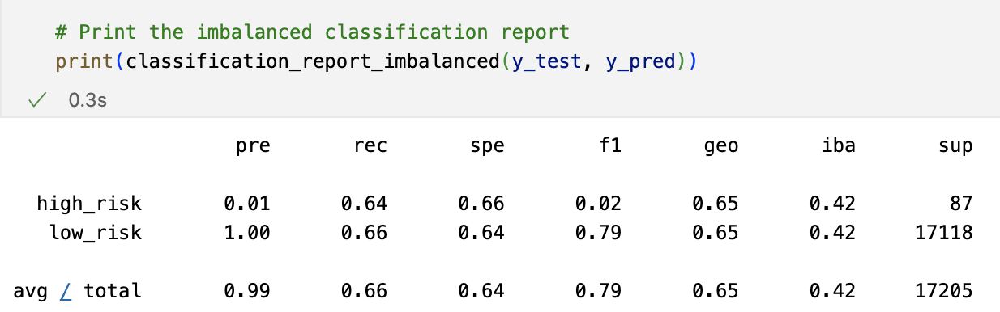

# Credit Risk Analysis

## Purpose

The purpose of this analysis is to look at data from LendingClub, a peer-to-peer lending services company, and evaluate and train models with unbalanced classes. The Imbalanced-learn and scikit-learn libraries were utilized, as well as both over- and undersampling of the data. Finally, a written evaluation of the models was done to how well they predict credit card risk.

## Results

### Naive Random Oversampling

1. Balanced Accuracy: 0.6533977140416822
2. Precision: High Risk= 0.01; Low Risk = 1.00
3. Recall: High Risk= 0.63; Low Risk = 0.67

### SMOTE Oversampling

1. Balanced Accuracy: 0.6512291961274883
2. Precision: High Risk= 0.01; Low Risk = 1.00
3. Recall: High Risk= 0.64; Low Risk = 0.66

### Undersampling 

1. Balanced Accuracy: 0.6512291961274883
2. Precision: High Risk= 0.01; Low Risk = 1.00
3. Recall: High Risk= 0.56; Low Risk = 0.47

### Combination (Over and Under) Sampling 

1. Balanced Accuracy: 0.5147555910092623
2. Precision: High Risk= 0.01; Low Risk = 1.00
3. Recall: High Risk= 0.69; Low Risk = 0.60

### Balanced Random Forest Classifier 

1. Balanced Accuracy: 0.7877672625306695
2. Precision: High Risk= 0.04; Low Risk = 1.00
3. Recall: High Risk= 0.67; Low Risk = 0.91

### Easy Ensemble AdaBoost Classifier 

1. Balanced Accuracy: 0.925427358175101
2. Precision: High Risk= 0.07; Low Risk = 1.00
3. Recall: High Risk= 0.91; Low Risk = 0.94

## Summary

Looking at all the models used the Easy Ensemble AdaBoost Classifier yielded the best results. At a .93 accuracy score, and an average overall .94 recall rating, it had the best results of any of the models tested. Looking more specifically at the "High Risk" results, this model had the highest precision of .07, and the highest recall score of .91, contributing to the F1 score of .14. 

Based on the data used from LendingClub and the results of the analysis, if a machine learning model needed to be used to predict credit card risk, the Easy Ensemble AdaBoost Classifier model would be the one to use moving forward.
